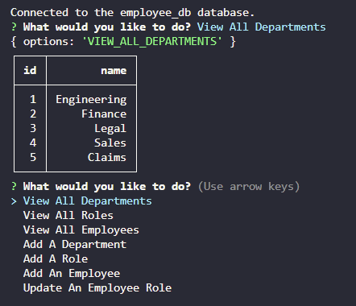

# employee-tracker

The employee tracker is an app that allows business owners to view and manage their departments, roles, and employee.
## Technoogies Used
* Node.js  
* npm
* JavaScript
* MySQL
* MySQL2
## Description
The app will prompt the user with a series of options regarding viewing the departments, roles, and employees as well as adding a department role, employee, and updating an employee role. This will help the user stay organized.

## Visual

## Installation
To install the necessary dependencies, run the following commands:
* npm i inquirer@8.2.4  
* npm i console-table-printer  
* npm i mysql2  

## Usage
Enter, "npm start" into the terminal to start the server. Enter, "ctrl + c" to turn off the server.  
## License
This application is licensed by MIT.  
License URL: https://opensource.org/licenses/MIT

## GitHub Repository

## Author & Contributors
* https://github.com/thoak90codes
* UW Coding Bootcamp